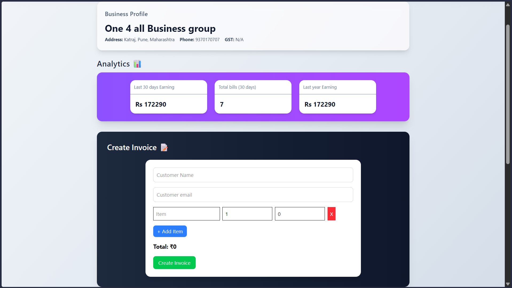
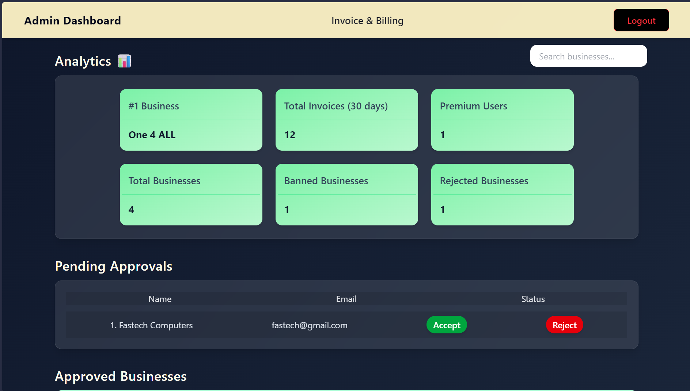
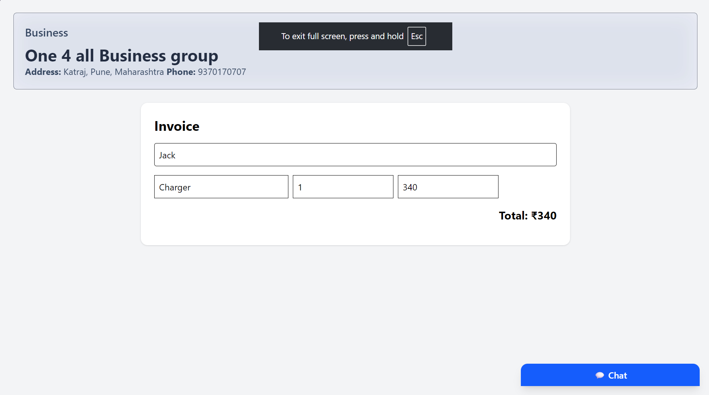
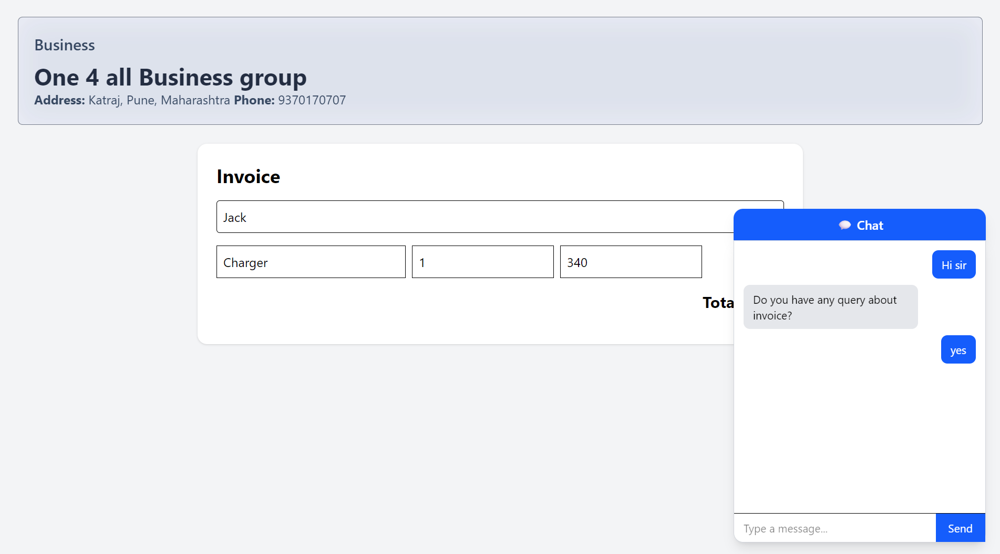

<h1 align="center">🚀 Invoice & Billing System (SaaS Style)</h1>
<p align="center">Full-stack billing solution with real-time chat & payments</p>


---

## 📸 Screenshots


### 🧾 Dashboard

<p align="center">
  
</p>

### 🧾 Admin Dashboard

<p align="center">
  
</p>

### 📄 Invoice Page

<p align="center">
  
</p>

### 💬 Live Chat

<p align="center">
  
</p>

---

## ✨ Features

### 🔐 Authentication & Authorization

- User Signup & Login
- JWT-based authentication
- Secure password hashing
- Role-based access (Business Owner / Customer)

---

### 🧾 Invoice Management

- Create, edit, and delete invoices
- Email invoice sending
- Auto-generated invoice IDs
- Itemized billing (products/services)
- Automatic total calculation

---

### 🏢 Business Profile

- Manage business details
- Auto-fill business info in invoices

---

### 💳 Payment Integration

- Razorpay payment gateway integration
- Premium feature unlock via payments

---

### 💬 Real-Time Chat System

- Live chat using Socket.IO
- Business ↔ Customer communication
- Token-based user identification
- Floating chat widget on invoice page
- Load previous messages

---

### 📊 Analytics

- Invoice aggregation using MongoDB
- Total invoices per user
- Sort & analyze billing data

---

### ⚡ Security & Performance

- API rate limiting
- Protected routes
- Optimized backend structure

---

### 🎨 UI/UX

- Responsive design with Tailwind CSS
- Clean dashboard interface
- Optimized utility classes
- Dynamic UI updates

---

### ⭐ Premium Features

- Subscription-based feature access
- Conditional UI rendering
- Payment-based activation

---

## 🧠 Tech Stack

**Frontend**

- HTML
- Tailwind CSS
- JavaScript

**Backend**

- Node.js
- Express.js

**Database**

- MongoDB (Mongoose)

**Real-Time**

- Socket.IO

**Payments**

- Razorpay

---

## 📁 Project Structure

```
project-root/
│
├── backend/
│   ├── routes/
│   ├── controllers/
│   ├── models/
│   ├── middleware/
│   └── app.js
│
├── frontend/
│   ├── pages/
│   ├── scripts/
│   ├── styles/
│
├── screenshots/
└── README.md
```

---

## ⚙️ Installation & Setup

```bash
# Clone the repository
git clone https://github.com/piyushkale/Invoice-and-Billing-WebApp

# Navigate to project
cd Invoice-and-Billing-WebApp

# Install backend dependencies
cd backend
npm install

# Start backend server
npm start
```

---

## 🔑 Environment Variables

Create a `.env` file in backend:

```
PORT=3000
MONGO_URI=your_mongodb_uri
JWT_SECRET=your_secret
RAZORPAY_KEY_ID=your_key
RAZORPAY_KEY_SECRET=your_secret
EMAIL=your_email
APP_PASSWORD=your_password
```


---

## 💡 Author

**Piyush Kale**

---

> If you like this project, consider giving it a ⭐ on GitHub!
